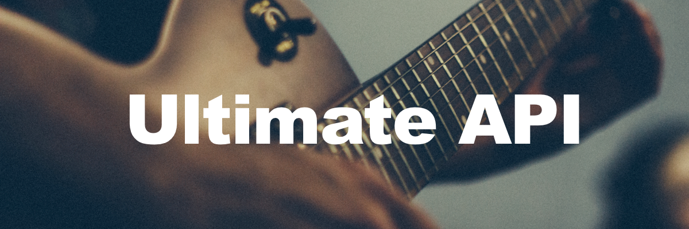

<p align="center">
    
</p>
<p align="center">:guitar: Download your favorite tabs from ultimate-guitar.com</p>

<p align="center">
  =3.6-blue.svg" />
  
</p>

## Features
- Download Ultimate Guitar tabs as:
  - JSON
  - [Tabdown]() format.
  - PDF
- [Tabdown]() spec and parser
- Coming Soon:
    - User Account Info
    - Access to your private tabs


## Installation
**Note:** Python 3.6 or higher is required. (Download python3 from https://www.python.org/downloads/)

```Bash
# Clone the repo
$ git clone git@github.com:joncardasis/ultimate-api.git
$ cd ultimate-api

# Install the requirements
$ python3 -m pip install -r requirements.txt
```

<!-- Create a virtual environment of python3:
    ```Python
    # Install virtualenv:
    # pip install virtualenv
    virtualenv -p /usr/local/bin/python3 venv
    source venv/bin/activate
    ``` -->

## Usage:

    ```Python
    export FLASK_DEBUG=1 // Export for debug
    python run.py
    ```


## Running Tests
To run the full test suite execute the following from the top level directory.
```Python
python test.py
```
